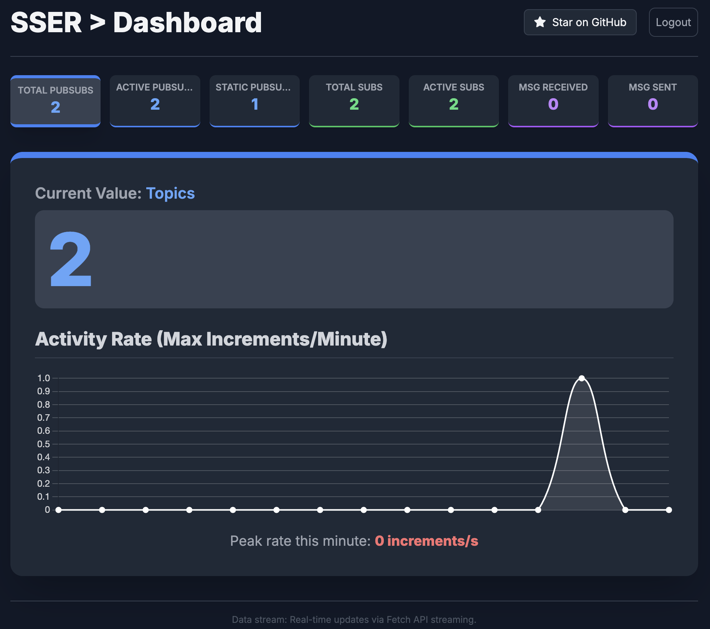

# SSER

A minimalist pubsub service that uses ServerSentEvents to deliver messages with zero dependency to external services as
a standalone library. It auto generates SSL certificate using Letsencrypt for the configured domain when ssl settings
is enabled on production environment.

## Setup

### Local

```
git clone https://github.com/hasmcp/sser
cd sser
cd cmd/api-server
go run main.go
```

### Production with Letsencrypt SSL

1. Create .env(`touch .env`) file that includes the following information (fill the tokens and ports as you wish):

```
APP_ENV=production
PORT=:80
SSER_API_ACCESS_TOKEN=
SSER_METRICS_ACCESS_TOKEN=
SSER_DOMAIN_NAME=yourdomain.com

# SSL configs below
SSLPORT=:443
SSER_SSL_ENABLED=true
SSER_LETSENCYRPT_EMAIL=your@email.com

# Persistent storage
SSER_PERSISTENT_STORE_ENABLED=true
```

2. Download the configuration yamls into config folder and edit as needed:

```
mkdir -p ./_config/certs
mkdir ./_storage
cd _config
wget https://raw.githubusercontent.com/hasmcp/sser/refs/heads/main/cmd/api-server/_config/base.yaml
wget https://raw.githubusercontent.com/hasmcp/sser/refs/heads/main/cmd/api-server/_config/production.yaml
```

3. Run the app

```
docker pull hasmcp/sser

# In the parent directory of the _config directory.
docker run --env-file .env -p 80:80 -p 443:443 --name sser -v ./_config:/_config -v ./_storage:/_storage hasmcp/sser:latest
```

## Dashboard

SSER comes with built-in dashboard that helps tracking the total/active topics, subscribers and messages in realtime.



http://localhost:8889

## API

This document describes the core API endpoints for managing PubSub topics and event streams. The API documentation is also available [OpenApiSpec 3.1](./sdks/openspec3.1/sser.yaml).

### Base URL

All endpoints are relative to the user-defined base URL (e.g., `http://localhost:8889`).

### 1. Create PubSub Topic

Creates a new message queue or topic. The response will typically include the newly created topic's unique ID.

| Attribute          | Value                                  |
| ------------------ | -------------------------------------- |
| **Method**         | `POST`                                 |
| **URI**            | `/api/v1/pubsubs`                      |
| **Authentication** | Bearer Token (`SSER_API_ACCESS_TOKEN`) |
| **Content-Type**   | `application/json`                     |

### Request Body

This endpoint currently accepts an empty JSON object to create a default topic.

Create an inmemory topic:

```
{
  "pubsub": {"persist": false}
}
```

Create a persistent topic:

```
{
  "pubsub": {"persist": true}
}
```

#### Example

```
curl -H 'Authorization: Bearer $SSER_API_ACCESS_TOKEN' -H 'Content-Type: application/json' -X POST -d '{}' '$BASE_URL/api/v1/pubsubs'
```

### 2. Delete PubSub Topic

Deletes an existing PubSub topic by its unique ID.

| Attribute          | Value                                  |
| ------------------ | -------------------------------------- |
| **Method**         | `DELETE`                               |
| **URI**            | `/api/v1/pubsubs/:id`                  |
| **Authentication** | Bearer Token (`SSER_API_ACCESS_TOKEN`) |

#### Path Parameters

| Name  | Type   | Description                                      |
| ----- | ------ | ------------------------------------------------ |
| `:id` | string | The unique ID of the PubSub topic to be deleted. |

#### Example

```
curl -H 'Authorization: Bearer $SSER_API_ACCESS_TOKEN' -X DELETE '$BASE_URL/api/v1/pubsubs/00Q72zvO87K'
```

### 3. Publish Event to Topic

Publishes an event (message) to a specified PubSub topic.

| Attribute          | Value                                  |
| ------------------ | -------------------------------------- |
| **Method**         | `POST`                                 |
| **URI**            | `/api/v1/pubsubs/:id/events`           |
| **Authentication** | Bearer Token (`SSER_API_ACCESS_TOKEN`) |
| **Content-Type**   | `application/json`                     |

#### Path Parameters

| Name  | Type   | Description                                                |
| ----- | ------ | ---------------------------------------------------------- |
| `:id` | string | The unique ID of the PubSub topic to publish the event to. |

#### Request Body

The payload requires an event object. This object must contain a `message` field, which can be any JSON-serializable type (string, number, object, etc.).

The event object also accepts two optional fields:

`id` (string): A unique identifier for the event. If provided, this is sent to the client as the SSE id field.

`type` (string): A type identifier for the event. If provided, this is sent to the client as the SSE event field.

#### Example

This example shows the request body including all optional parameters:

```
curl -H 'Authorization: Bearer $SSER_API_ACCESS_TOKEN' \
     -H 'Content-Type: application/json' \
     -X POST \
     -d '{
           "event": {
             "id": "order-update-456",
             "type": "ORDER_SHIPPED",
             "message": {
               "order_id": 9001,
               "status": "shipped"
             }
           }
         }' \
     '$BASE_URL/api/v1/pubsubs/00Q72zvO87K/events'
```

### 4. Subscribe to Topic Events (Server-Sent Events)

Establishes a long-lived connection to stream events published to a specified topic using the Server-Sent Events (SSE) protocol.

| Attribute          | Value                                        |
| ------------------ | -------------------------------------------- |
| **Method**         | `GET`                                        |
| **URI**            | `/api/v1/pubsubs/:id/events`                 |
| **Authentication** | Bearer Token (**`SSER_TOPIC_ACCESS_TOKEN`**) |

#### Path Parameters

| Name  | Type   | Description                                        |
| ----- | ------ | -------------------------------------------------- |
| `:id` | string | The unique ID of the PubSub topic to subscribe to. |

#### Pass topic access token as query string

Passing topic's access token as query string would allow using browser's default EventSource class.

```
?access_token=$SSER_TOPIC_ACCESS_TOKEN
```

#### Example

```
curl -i -H 'Authorization: Bearer $SSER_TOPIC_ACCESS_TOKEN' -X GET '$BASE_URL/api/v1/pubsubs/00Q72zvO87K/events'
```

## License

[AGPLv3](https://www.gnu.org/licenses/agpl-3.0.en.html)
